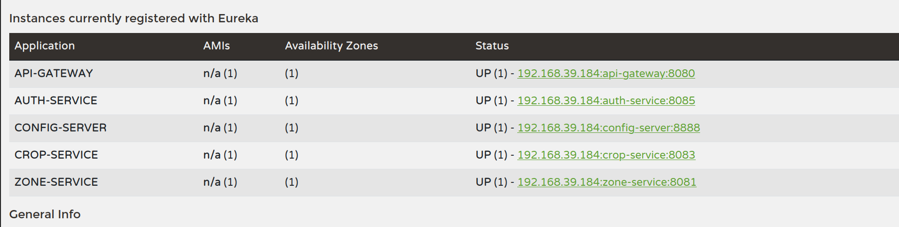

#  Automated Greenhouse Management System (AGMS)

A cloud native microservices ecosystem designed to monitor crop health, manage cultivation zones, and automate climate responses using real-time IoT data.

---

## Architecture Overview

AGMS is built using a **Spring Cloud distributed architecture** following a "Gatekeeper" pattern — all external traffic hits the Gateway, which validates the JWT before routing to internal services.

```text
                                    ┌─────────────────┐
                                    │   API Gateway   │
                                    │   (Port 8080)   │
                                    └────────┬────────┘
                                             │ (JWT Validated)
              ┌──────────────────────────────┼─────────────────────────────┐
              │                              │                             │
              ▼                              ▼                             ▼
┌─────────────────────┐          ┌─────────────────────┐          ┌─────────────────────┐
│    Auth Service     │          │    Zone Service     │          │    Crop Service     │
│    (Port 8081)      │          │                     │          │                     │
│    + Auth DB        │          │    + Zone DB        │          │    + Crop DB        │
└─────────────────────┘          └──────────┬──────────┘          └──────────┬──────────┘
                                             ▲                               │
                                             │ (Update State)                │ (Mapped)
                                             │                               ▼
┌─────────────────────┐          ┌──────────┴──────────┐          ┌─────────────────────┐
│    External IoT     │          │   Sensor Service    │          │    Greenhouse       │
│  (104.211.95.241)   │◄─────────┤  (Scheduled Tasks)  │          │   Physical Layout   │
│    API Provider     │ (Fetch)  │    + Automation     │          │                     │
└─────────────────────┘          └─────────────────────┘          └─────────────────────┘
```

### Services at a Glance

| Service | Port | Role |
|:---|:---|:---|
| **Eureka Server** | `8761` | Service discovery and health monitoring |
| **Config Server** | `8888` | Centralized Git-backed configuration |
| **API Gateway** | `8080` | Single entry point — JWT validation & routing |
| **Auth Service** | `8081` | User registration, login, JWT issuance |
| **Zone Service** | `8082` | Manages physical greenhouse sectors & device mappings |
| **Crop Service** | `8083` | Maintains planting plans & optimal thresholds |
| **Sensor Service** | `8084` | The "Brain" — polls IoT API & triggers automation |

---
## Key Features

-  **Centralized Security** — Stateless JWT authentication enforced at the Gateway
-  **IoT Integration** — Sensor service polls external IoT provider (`104.211.95.241`)
-  **Edge Automation** — Scheduled tasks compare real-time data against crop thresholds
-  **Relational Management** — Crops are assigned to specific Zones with optimal conditions
-  **Cloud Native** — Centralized config via Spring Cloud Config + Eureka service discovery

---

## Technology Stack

| Component | Technology | Purpose |
|:---|:---|:---|
| **Framework** | Spring Boot 3.x | Core Service Framework |
| **Discovery** | Netflix Eureka | Service Registration & Health |
| **Config** | Spring Cloud Config | Git-backed Centralized Config |
| **Gateway** | Spring Cloud Gateway | Routing & JWT Filtering |
| **HTTP Client** | OpenFeign | Inter-service & IoT API communication |
| **Security** | JJWT | Token Generation & Validation |
| **Database** | MariaDB / MySQL | Relational Data Storage |
| **Build Tool** | Maven 3.8+ | Dependency & Build Management |

---

## Getting Started

### Prerequisites

- Java 17+
- Maven 3.8+
- MySQL / MariaDB running locally
- Git

---

### 1. Config Repository Setup 

This project uses a **centralized config repository** hosted on GitHub:

> 🔗 **Config Repo:** [https://github.com/BhushithaHashan/agms_config](https://github.com/BhushithaHashan/agms_config)

The JWT Secret Key is **not included in the source code** for security. You must add it manually:

1. Clone the config repo:
   ```bash
   git clone https://github.com/BhushithaHashan/agms_config.git
   ```

2. Open `application.yml` in the config repo and add:
   ```yaml
   jwt:
     secret: "ENTER_YOUR_32_CHARACTER_SECRET_HERE"
   ```

3. Commit and push the change:
   ```bash
   git add .
   git commit -m "add jwt secret"
   git push
   ```

>  This secret **must match** between the Auth Service and the API Gateway. If they differ, all requests will return `401 Unauthorized`.

---

### 2. Database Setup

Create the required databases in MariaDB/MySQL:

```sql
CREATE DATABASE auth_db;
CREATE DATABASE zone_db;
```

---

### 3. Startup Order

Start the services in this **exact order** to ensure the mesh connects correctly:

```
1. eureka-server      (port 8761)  ← Service registry must be first
2. config-service     (port 8888)  ← Config must load before services
3. auth-service       (port 8081)  ← Auth before Gateway
4. zone-service       
5. crop-service       
6. api-gateway        (port 8080)
7. sensor-service     ← Automation begins immediately on startup
```
---

---
## Security Flow

AGMS uses a **Stateless JWT authentication** pattern:

1. User registers via `POST /api/auth/register`
2. User logs in via `POST /api/auth/login` → receives signed JWT
3. User includes JWT in all subsequent requests: `Authorization: Bearer <token>`
4. **API Gateway** intercepts every request, verifies the token signature using the shared `jwt.secret`
5. On success → extracts `username` and injects it into the `X-User-Id` header for downstream services
6. On failure → returns `401 Unauthorized` immediately

---

## Automation Logic

The Sensor Service runs a **pulse every 10 seconds**:

```
1. Fetch   → Get all active crops and their optimal temperatures
2. Lookup  → Find the corresponding deviceId for each zone
3. Poll    → Call external IoT API (104.211.95.241) for real time temperature
4. Evaluate → Compare actual vs target
             If variance > 2°C → trigger system alert in logs
```

---

## API Endpoints

### Authentication
> `POST /api/auth/register` — Public

```json
{
  "username": "admin",
  "password": "password123"
}
```

> `POST /api/auth/login` — Public

```json
Response: { "token": "eyJhbG..." }
```

---

### Zone Management
> `GET /api/zones` — 🔒 JWT Required

Returns list of all greenhouse zones with device mappings.

> `POST /api/zones` — 🔒 JWT Required

```json
{
  "name": "North Section",
  "minTemp": 20.0,
  "maxTemp": 30.0
}
```

---

### Crop Management
> `GET /api/crops` — 🔒 JWT Required

Returns all crop types and their optimal thresholds.

> `POST /api/crops` — 🔒 JWT Required

```json
{
  "name": "Tomato",
  "optimalTemp": 24.0,
  "zoneId": 1
}
```

> `GET /api/crops/zone/{zoneId}` — 🔒 JWT Required

Lists all crops assigned to a specific zone.

---

### Sensor & Automation
> `GET /api/sensors/status` — Returns current IoT reading

> `POST /api/sensors/trigger-automation` — Manually triggers automation logic

---


